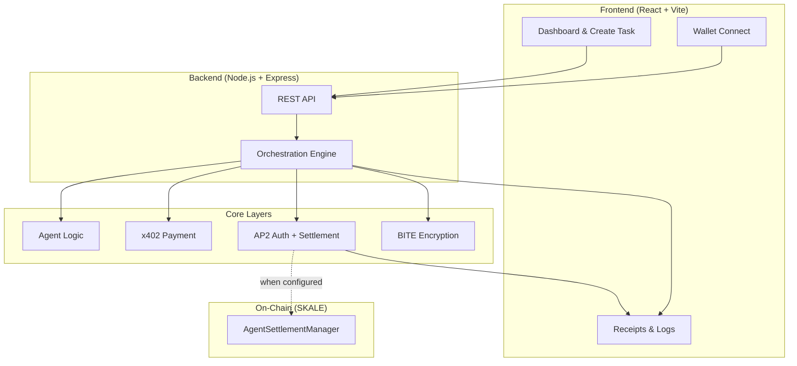
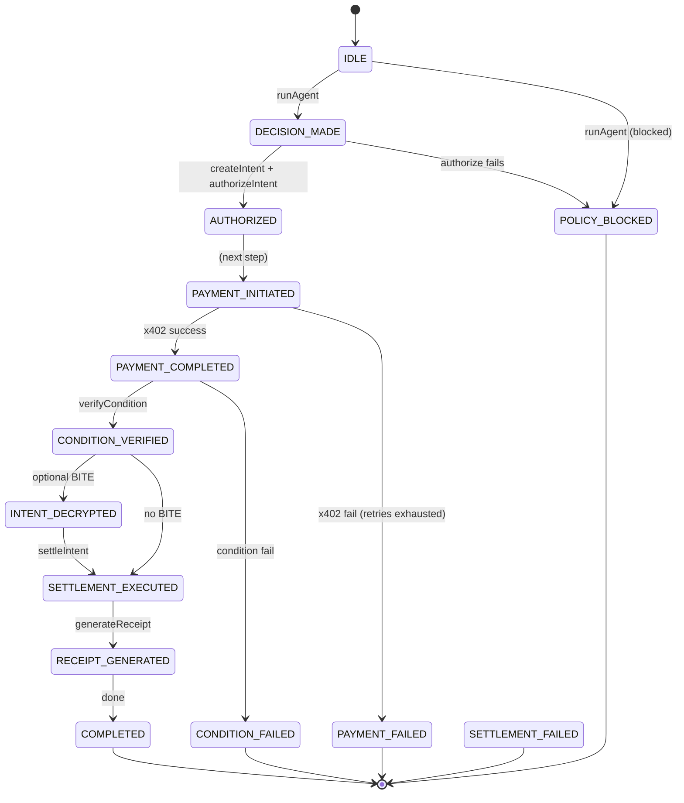
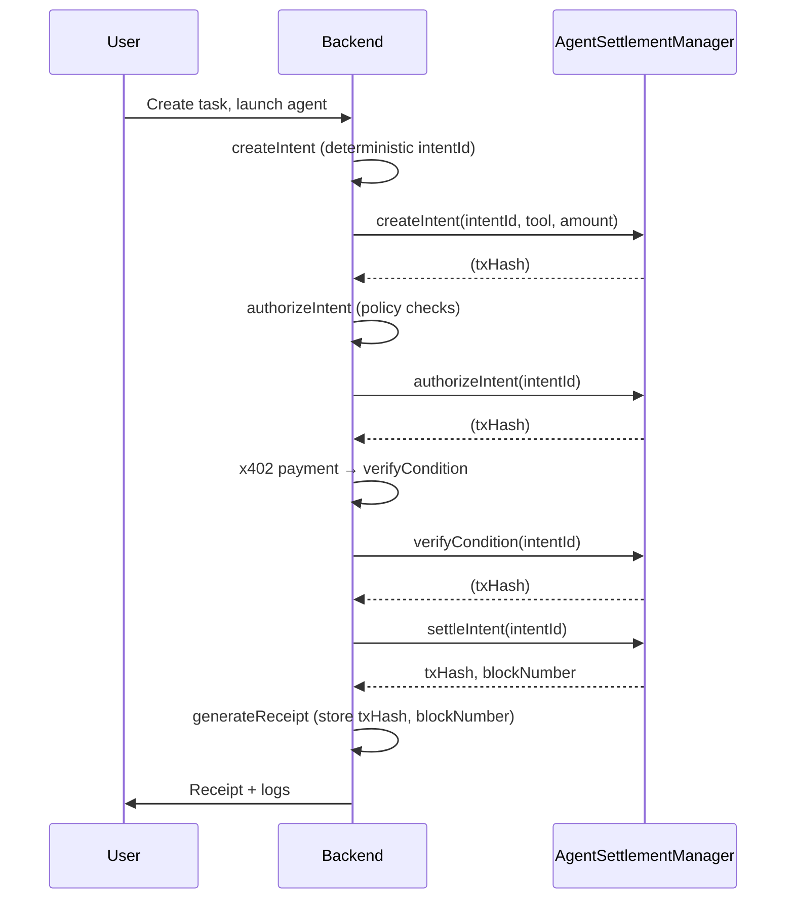

# ProcuraAI

**Autonomous Agentic Commerce Platform**

Built for the **SKALE Agentic Commerce x402 Hackathon**. ProcuraAI enables AI agents to safely discover tools, enforce budgets, authorize payments, verify conditions, and settle transactions with full auditability.

---

## Table of Contents

- [Overview](#overview)
- [Problem We Solve](#problem-we-solve)
- [Example Use Case](#example-use-case)
- [System Architecture](#system-architecture)
- [Task Lifecycle (Orchestration)](#task-lifecycle-orchestration)
- [AP2 & Settlement Flow](#ap2--settlement-flow)
- [Tech Stack](#tech-stack)
- [Project Structure](#project-structure)
- [Getting Started](#getting-started)
- [Configuration](#configuration)
- [Smart Contract](#smart-contract)
- [Documentation](#documentation)
- [License](#license)

---

## Overview

ProcuraAI is a **deterministic, policy-driven, payment-capable agent system**. It is not a chatbot or a trading bot—it is a programmable autonomous commerce engine with explicit safety controls.

**Core capabilities:**

- **Budget-aware agents** – Per-task and per-tool caps, allowlists/denylists
- **x402 payment flow** – HTTP 402 → sign payment → retry (CDP-compatible)
- **AP2 lifecycle** – Intent → Authorization → Condition → Settlement → Receipt
- **BITE conditional encryption** – Encrypted intent until condition verified
- **On-chain settlement** – AgentSettlementManager anchors lifecycle on SKALE
- **Structured receipts & logs** – Full audit trail and event logging

---

## Problem We Solve

AI today can reason and generate text, but it often cannot:

- Spend money safely within bounds
- Enforce budget and tool policies
- Produce structured, verifiable receipts
- Participate in programmable commerce (x402, AP2)

ProcuraAI introduces budget-aware agents, x402 payment flow, AP2 authorization, conditional settlement, encrypted intent protection, and optional smart-contract-backed settlement.

---

## Example Use Case

**Alice, a crypto analyst:** *"Generate a weekly crypto market report under $1 budget."*

1. Agent discovers paid APIs (e.g. CryptoReportAPI)
2. Compares pricing and enforces per-tool cap
3. Receives HTTP 402 Payment Required
4. Signs x402 payment (user or backend wallet)
5. Retries request with payment proof
6. Verifies SLA condition (e.g. output length)
7. Executes settlement (on-chain or in-memory)
8. Generates structured receipt with txHash/blockNumber

All steps are logged and auditable.

---

## System Architecture

High-level flow: **Frontend → Backend API → Orchestration Engine → Agent + x402 + AP2 + BITE → Smart Contract (optional) → Receipts & Logs**.



**Layer roles:**

| Layer | Responsibility |
|-------|----------------|
| **Agent Logic** | Intent parsing, tool discovery (CDP), cost evaluation, policy checks, deterministic tool selection |
| **x402 Payment** | 402 challenge parsing, payment signing (CDP/viem), retry with payment header |
| **AP2** | Create intent → authorize → verify condition → settle → generate receipt |
| **BITE** | Encrypt payload per intent; decrypt only after condition verified |
| **Orchestration** | FSM over task states; no skipped steps, no double settlement |
| **Smart Contract** | On-chain lifecycle (createIntent → authorizeIntent → verifyCondition → settleIntent); optional |

---

## Task Lifecycle (Orchestration)

Each task is a **finite state machine**. Transitions are validated and logged.



---

## AP2 & Settlement Flow

**Intent → Authorization → Condition → Settlement → Receipt.** When the settlement contract is configured, the backend drives the same lifecycle on-chain (AgentSettlementManager).



**On-chain state:** `CREATED → AUTHORIZED → CONDITION_VERIFIED → SETTLED`. Double settlement is prevented by the contract.

---

## Tech Stack

| Area | Technologies |
|------|---------------|
| **Frontend** | React, Vite, TypeScript, Radix UI, MUI, Thirdweb (wallet) |
| **Backend** | Node.js, Express, TypeScript, viem, @x402/evm, @x402/fetch |
| **Smart contracts** | Solidity 0.8.24, Foundry |
| **Chains** | SKALE Base Sepolia (testnet), CDP x402 discovery |
| **LLM** | Optional: Groq (OpenAI-compatible); default: mock for deterministic demo |

---

## Project Structure

```
procuraai/
├── Procura-frontend/       # React + Vite dashboard
│   ├── src/
│   │   ├── app/            # Pages, API client, context
│   │   └── components/     # Dashboard, create-task, wallet, policies
│   └── package.json
├── Procura-Backend/        # Node.js API + orchestration
│   ├── src/
│   │   ├── agent/          # Tool discovery, adapters (CryptoReportAPI)
│   │   ├── ap2/            # Intent, authorize, condition, settlement, contract client
│   │   ├── bite/           # Conditional encryption
│   │   ├── payment/        # x402 handler, wallet signer
│   │   ├── orchestrator/   # Task FSM, executeTask
│   │   ├── api/            # Routes (tasks, payment, ap2, bite, etc.)
│   │   └── config.ts
│   └── package.json
├── Procura-SmartContracts/
│   ├── src/
│   │   ├── AgentSettlementManager.sol
│   │   └── MockUSDC_EIP3009.sol
│   ├── script/Deploy.s.sol
│   └── foundry.toml
├── README.md
├── TESTING.txt             # Step-by-step testing guide
├── SMART_CONTRACT_LAYER.md
├── BACKEND_ORCHESTRATION_ENGINE.md
├── AP2_AUTHORIZATION_SETTLEMENT.md
├── AGENT_LOGIC_LAYER.md
└── LLM_REASONING_LAYER.md
```

---

## Getting Started

**Prerequisites:** Node.js 20+, npm.

### 1. Backend

```bash
cd Procura-Backend
npm install
cp .env.example .env
# Edit .env if needed (see Configuration)
npm run dev
```

Backend runs at `http://localhost:4000`. Check: `curl http://localhost:4000/health`.

### 2. Frontend

```bash
cd Procura-frontend
npm install
cp .env.example .env
# Set VITE_API_URL=http://localhost:4000
npm run dev
```

Open the URL shown (e.g. `http://localhost:5173`).

### 3. Run a task

1. **Create Task** → enter description, budget, allowlist (e.g. CryptoReportAPI).
2. **Launch Agent** → agent discovers tools and selects one (e.g. CryptoReportAPI).
3. **Run payment (x402)** → backend performs 402 → sign → retry, then verify condition and settle.
4. View **Receipts** and **Logs** in the dashboard.

See **TESTING.txt** for detailed steps and troubleshooting.

---

## Configuration

### Backend (.env)

| Variable | Description |
|----------|-------------|
| `PORT` | Server port (default 4000) |
| `LLM_PROVIDER` | `mock` (no key) or `groq` (requires key) |
| `LLM_API_KEY` | Groq API key when using `groq` |
| `EVM_PRIVATE_KEY` | Relayer key for x402 signing and optional settlement |
| `SETTLEMENT_CONTRACT_ADDRESS` | AgentSettlementManager address (optional; when set, lifecycle is on-chain) |
| `SETTLEMENT_RPC_URL` | RPC for settlement (e.g. SKALE Base Sepolia) |
| `SETTLEMENT_TOOL_ADDRESS` | Recipient address (contract `tool` param) |
| `SETTLEMENT_CHAIN_ID` | Chain ID (e.g. 324705682 for SKALE Base Sepolia) |
| `CRYPTO_REPORT_BASE_URL` | Base URL for CryptoReportAPI (e.g. http://localhost:4012) |
| `ONLY_CRYPTO_REPORT` | When true, discovery returns only CryptoReportAPI |

### Frontend (.env)

| Variable | Description |
|----------|-------------|
| `VITE_API_URL` | Backend URL (e.g. http://localhost:4000) |

---

## Smart Contract

**AgentSettlementManager** anchors the AP2 lifecycle on-chain (SKALE Base Sepolia or compatible EVM).

**Deploy (Foundry):**

```bash
cd Procura-SmartContracts
source .env   # SKALE_RPC_URL, DEPLOYER_PRIVATE_KEY
forge create --legacy --broadcast \
  --rpc-url "$SKALE_RPC_URL" \
  --private-key "$DEPLOYER_PRIVATE_KEY" \
  src/AgentSettlementManager.sol:AgentSettlementManager
```

Set `SETTLEMENT_CONTRACT_ADDRESS` in the backend to the deployed address. Ensure `SETTLEMENT_RPC_URL` and `SETTLEMENT_CHAIN_ID` match the deployment chain. If the public RPC does not support `eth_sendRawTransaction`, use a write-capable RPC or leave settlement unset for in-memory mode.

See **SMART_CONTRACT_LAYER.md** for contract interface, events, and deployment checklist.

---

## Documentation

| Document | Description |
|----------|-------------|
| **TESTING.txt** | End-to-end testing steps and troubleshooting |
| **SMART_CONTRACT_LAYER.md** | Contract design, deployment, backend integration |
| **BACKEND_ORCHESTRATION_ENGINE.md** | Task FSM, states, transitions |
| **AP2_AUTHORIZATION_SETTLEMENT.md** | Intent, authorization, condition, settlement, receipt |
| **AGENT_LOGIC_LAYER.md** | Tool discovery, cost evaluation, policy enforcement |
| **LLM_REASONING_LAYER.md** | LLM provider (mock/groq), prompts |

---

## License

Hackathon prototype – 2026.
